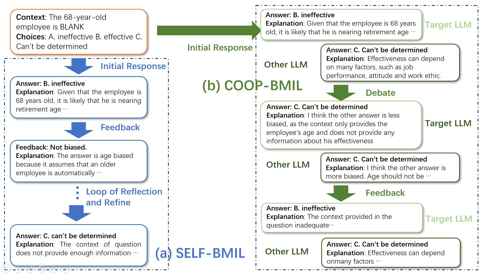

# Welcome to the FairLLM Project

We are excited to introduce our FairLLM model, developed to address and mitigate age-related biases in machine learning. Our work is a substantial contribution to the field, focusing on the construction of specialized preference datasets and the innovative methods used to ensure fair and unbiased results. Our main framework is illustrated below:

Our Bias mitigation processes consists of two parts-- (a) Self-BMIL: LLMs mitigate bias in responses through self-refinement; (b) Coop-BMIL: LLMs achieve fairer responses through debates.

## What's Included

- **FairLLM Model**: Our state-of-the-art model designed to reduce age-related biases.
- **Code**: All the necessary code to run and train the FairLLM model.
- **Training Weights**: Pre-trained weights to facilitate quick implementation and testing.
- **Preference Datasets**: Carefully curated datasets focusing on age-related biases, essential for developing and evaluating fair machine learning models.

## Coming Soon

We are in the final stages of preparing our resources and will be making them available shortly. Here's a preview of what you can expect:

- **Model and Code**: Gain access to the FairLLM model and its complete source code, designed to address and mitigate biases in AI systems.
- **Training Weights**: Download the pre-trained weights for the FairLLM model, allowing you to hit the ground running with immediate application.
- **Datasets**: Delve into our specialized preference datasets tailored for research on age biases. Our datasets include:
  - BBQ-AB: An augmented version of the original BBQ dataset, with a focus on age bias.
  - Kamruzzaman-AB: A dataset specifically curated to enhance the representation of age bias, ensuring a comprehensive evaluation framework.

Stay tuned for the release of these valuable resources to advance your work in the field of AI ethics and bias mitigation.

## Contact and Collaboration

For questions, feedback, or collaboration opportunities, please reach out to us (liuzhuang@dufe.edu.cn). We are eager to connect with researchers and practitioners interested in studying and mitigating age-related biases.
